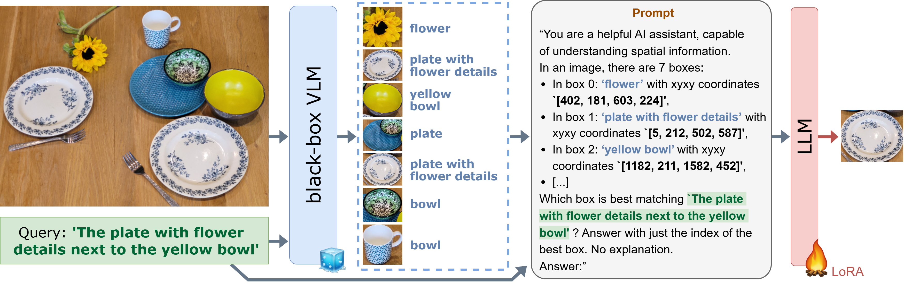
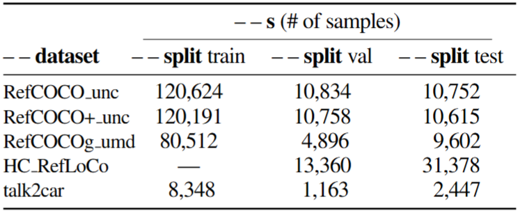

<div align="center">

# LLM-wrapper: Black-Box Semantic-Aware Adaptation of Vision-Language Models for Referring Expression Comprehension [ICLR 2025]

[](https://openreview.net/forum?id=PgXpOOqtyd&noteId=PgXpOOqtyd)  [](https://arxiv.org/abs/2409.11919)
[](https://valeoai.github.io/publications/llm_wrapper/)

This is the official implementation of the paper "LLM-wrapper: Black-box Semantic-Aware adaptation of VLMs for Referring Expression Comprehension" (ICLR 2025).

</div>

## 👁️ LLM-wrapper overview



LLM-wrapper is a method for ‘black-box’ adaptation of VLMs for Referring Expression (REC). It capitalizes on the reasoning abilities of LLMs, improved with a LoRA fine-tuning, to select the most relevant bounding box among candidates generated by a VLM. LLM-wrapper is VLM/LLM-agnostic, it can adapt closed-source VLMs, transfer to new VLMs and datasets, and ensemble candidate boxes from various VLMs. Please refer to the Licenses below.

## :hammer_and_wrench: Install

### Disclaimer

* The code was developped to be used on 40GB A100 / L40S GPUs.
* Among the VLMs used in the paper's experiments, only the code related to Florence-2-L and Florence-2-L-FT is released.

### Environment

```bash
# Conda environment
conda create --name LLM_wrapper python=3.9.18
conda activate LLM_wrapper

# Install proper pytorch version
conda install pytorch==2.2.1 torchvision==0.17.1 torchaudio==2.2.1 pytorch-cuda=11.8 -c pytorch -c nvidia

# Install all requirements
pip install -e .
pip install --no-build-isolation flash-attn==2.7.3
```

### HuggingFace models

The currently released code is implemented for using:
* as VLMs, **Florence-2-L** (``--VLM Florence-2-large-v2``) and **Florence-2-L-FT** (``--VLM Florence-2-large-ft-v2``) from HuggingFace.
* as LLMs, **Llama 3 8B Instruct** (``--LLM Meta-Llama-3-8B-Instruct``), **Mixtral 8x7B Instruct** (``--LLM Mixtral-8x7B-Instruct-v0.1``), **Gemma 2 (2/9B) Instruct** (``--LLM gemma-2-2b-it``, ``--LLM gemma-2-9b-it``), **GPT-neo** (``--LLM gpt-neo-2.7B``, ``--LLM gpt-neo-1.3B``, ``--LLM gpt-neo-125m``) from HuggingFace.

Create and add a json file named ``LLM_token.json``, containing a **valid HuggingFace token** under string format, in the ``./llm_wrapper`` folder. Ensure you requested the proper rights on HuggingFace (e.g., to use Meta's
Llama 3 8B Instruct LLM, etc.).

### Checkpoints

We release 8 checkpoints (LoRA weights) related to LLM-wrapper's adaptation of **Florence-2-Large** with respect to different combinations of LLM (**Meta-Llama-3-8B-Instruct** and **Mixtral 8x7B Instruct**) and training data (RefCOCO, RefCOCO+, RefCOCOg and Talk2Car). These checkpoints lead to the REC results given in the paper's main results.

<table style="margin: auto">
  <thead>
    <tr>
      <th>LLM</th>
      <th># of<br />LoRA params</th>
      <th>Training data</th>
      <th>LLM-wrapper</th>
    </tr>
  </thead>
  <tbody>
    <tr>
      <td>LLama 3 8B Instruct</td>
      <td align="left">352M</td>
      <td align="left">RefCOCO train (unc)</td>
      <td><a href="https://github.com/valeoai/LLM_wrapper/releases/download/v1.0.0/FT_Llama3_8_on_RefCOCO_for_Flo2L_chunked.tar.gz.part_aa">part 1</a>, <a href="https://github.com/valeoai/LLM_wrapper/releases/download/v1.0.0/FT_Llama3_8_on_RefCOCO_for_Flo2L_chunked.tar.gz.part_ab">part 2</a>, <a href="https://github.com/valeoai/LLM_wrapper/releases/download/v1.0.0/FT_Llama3_8_on_RefCOCO_for_Flo2L_chunked.tar.gz.part_ac">part 3</a></td>
    </tr>
    <tr>
      <td>LLama 3 8B Instruct</td>
      <td align="left">352M</td>
      <td align="left">RefCOCO+ train (unc)</td>
      <td><a href="https://github.com/valeoai/LLM_wrapper/releases/download/v1.0.0/FT_Llama3_8_on_RefCOCO+_for_Flo2L_chunked.tar.gz.part_aa">part 1</a>, <a href="https://github.com/valeoai/LLM_wrapper/releases/download/v1.0.0/FT_Llama3_8_on_RefCOCO+_for_Flo2L_chunked.tar.gz.part_ab">part 2</a>, <a href="https://github.com/valeoai/LLM_wrapper/releases/download/v1.0.0/FT_Llama3_8_on_RefCOCO+_for_Flo2L_chunked.tar.gz.part_ac">part 3</a></td>
    </tr>
    <tr>
      <td>LLama 3 8B Instruct</td>
      <td align="left">352M</td>
      <td align="left">RefCOCOg train (umd)</td>
      <td><a href="https://github.com/valeoai/LLM_wrapper/releases/download/v1.0.0/FT_Llama3_8_on_RefCOCOg_for_Flo2L_chunked.tar.gz.part_aa">part 1</a>, <a href="https://github.com/valeoai/LLM_wrapper/releases/download/v1.0.0/FT_Llama3_8_on_RefCOCOg_for_Flo2L_chunked.tar.gz.part_ab">part 2</a>, <a href="https://github.com/valeoai/LLM_wrapper/releases/download/v1.0.0/FT_Llama3_8_on_RefCOCOg_for_Flo2L_chunked.tar.gz.part_ac">part 3</a></td>
    </tr>
    <tr>
      <td>LLama 3 8B Instruct</td>
      <td align="left">352M</td>
      <td align="left">Talk2Car train</td>
      <td><a href="https://github.com/valeoai/LLM_wrapper/releases/download/v1.0.0/FT_Llama3_8_on_Talk2Car_for_Flo2L_chunked.tar.gz.part_aa">part 1</a>, <a href="https://github.com/valeoai/LLM_wrapper/releases/download/v1.0.0/FT_Llama3_8_on_Talk2Car_for_Flo2L_chunked.tar.gz.part_ab">part 2</a>, <a href="https://github.com/valeoai/LLM_wrapper/releases/download/v1.0.0/FT_Llama3_8_on_Talk2Car_for_Flo2L_chunked.tar.gz.part_ac">part 3</a></td>
    </tr>
    <tr>
      <td>Mixtral 8x7B Instruct</td>
      <td align="left">114M</td>
      <td align="left">RefCOCO train (unc)</td>
      <td><a href="https://github.com/valeoai/LLM_wrapper/releases/download/v1.0.0/FT_Mixtral_8x7_on_RefCOCO_for_Flo2L.tar.gz">part 1</a></td>
    </tr>
    <tr>
      <td>Mixtral 8x7B Instruct</td>
      <td align="left">114M</td>
      <td align="left">RefCOCO+ train (unc)</td>
      <td><a href="https://github.com/valeoai/LLM_wrapper/releases/download/v1.0.0/FT_Mixtral_8x7_on_RefCOCO+_for_Flo2L.tar.gz">part 1</a></td>
    </tr>
    <tr>
      <td>Mixtral 8x7B Instruct</td>
      <td align="left">114M</td>
      <td align="left">RefCOCOg train (umd)</td>
      <td><a href="https://github.com/valeoai/LLM_wrapper/releases/download/v1.0.0/FT_Mixtral_8x7_on_RefCOCOg_for_Flo2L.tar.gz">part 1</a></td>
    </tr>
    <tr>
      <td>Mixtral 8x7B Instruct</td>
      <td align="left">114M</td>
      <td align="left">Talk2Car train</td>
      <td><a href="https://github.com/valeoai/LLM_wrapper/releases/download/v1.0.0/FT_Mixtral_8x7_on_Talk2Car_for_Flo2L.tar.gz">part 1</a></td>
    </tr>
  </tbody>
</table>

Checkpoints are shared in the v1.0.0's release, as tar files, in 1 part for Mixtral and in 3 parts for Llama 3 8B (due to limitations on large binary attachments of GitHub). Please refer to [MODELS.md](MODELS.md) for the instructions on how to untar them. Once done, save the obtained checkpoint folder (containing the .pt, .json and .bin files) in a subfolder named ``my_FT_models``, placed in the proper folder, depending on the chosen training data (``./llm_wrapper/data/{dataset_name}/my_FT_models/{checkpoint_folder}``).

We are releasing these weights to the scientific community to foster research advances. Remark that the model / weights license is more restrictive than the code license. Please see below.

### Datasets

* **RefCOCO/+/g series**

To use the RefCOCO/+/g series with our code, you should first git clone the [refer repository](https://github.com/lichengunc/refer) into the ``./llm_wrapper/data`` folder. Follow the installation instructions and requirements given in the refer repository.

Add the corresponding COCO images in ``./llm_wrapper/data/COCO/images/train2014`` folder. Then use the following command to create our custom dataset files.

```bash
python ./llm_wrapper/data/create_3_refcoco_series_datasets.py
```

* **HC-RefLoCo**

Git clone the [HC-RefLoCo repository](https://github.com/ZhaoJingjing713/HC-RefLoCo) into the ``./llm_wrapper/data`` folder. Follow the HC-RefLoCo repository's instructions and requirements.

Add the corresponding images in ``./llm_wrapper/data/HC_RefLoCo/HC_RefLoCo_images`` folder. Then use the following command to create our custom dataset files.

```bash
python ./llm_wrapper/data/create_hcrefloco_dataset.py
```

* **Talk2Car**

Git clone the [Talk2Car repository](https://github.com/talk2car/Talk2Car.git) in the ``./llm_wrapper/data`` folder. Follow this repository's instructions and requirements (some that you may not have: spacy, nuscenes-devkit).

Add the corresponding nuscenes images in ``./llm_wrapper/data/nuscenes/samples`` and ``./llm_wrapper/data/nuscenes/sweeps`` folders. Then use the following command to create our custom dataset files.

```bash
python ./llm_wrapper/data/create_talk2car_dataset.py
```

## :pager: Commands

The dataset statistics (and associated argparse commands to use them) are given below.

<p align="left">
  
</p>


### VLM Inference (bounding box prediction)
```bash
# Using Florence-2-L (on RefCOCOg val split)
python ./llm_wrapper/VLM_inference_script.py --dataset RefCOCOg_umd --split val --s 4896 --VLM Florence-2-large-v2

# Using Florence-2-L-FT (on Talk2Car test split)
python ./llm_wrapper/VLM_inference_script.py --dataset talk2car --split test --s 2447 --VLM Florence-2-large-ft-v2
```

### REC eval

```bash
# Using a VLM only
python ./llm_wrapper/LLM_inference_script.py --dataset RefCOCOg_umd --split val --s 4896 --VLM Florence-2-large-v2 --VLM_only

# Using a VLM + LLM (zero-shot)
python ./llm_wrapper/LLM_inference_script.py --dataset RefCOCOg_umd --split val --s 4896 --VLM Florence-2-large-v2 --LLM Meta-Llama-3-8B-Instruct

# Using a VLM + LLM-wrapper (after LoRA fine-tuning for REC)
python ./llm_wrapper/LLM_inference_script.py --dataset RefCOCOg_umd --split val --s 4896 --VLM Florence-2-large-v2 --LLM FT_Llama3_8_on_RefCOCOg_for_Flo2L
```


### Training (LLM fine-tuning for VLM adaptation)
```bash
# Creating LLM fine-tuning data from classic REC datasets (with augmentation)
python ./llm_wrapper/LLM_inference_script.py --dataset RefCOCOg_umd --split train --s 80000 --FT --VLM Florence-2-large-v2 --LLM Meta-Llama-3-8B-Instruct
python ./llm_wrapper/LLM_inference_script.py --dataset RefCOCOg_umd --split val --s 500 --FT --VLM Florence-2-large-v2 --LLM Meta-Llama-3-8B-Instruct

# LoRA fine-tuning from 'scratch' (from chosen base HuggingFace LLM)
python ./llm_wrapper/LLM_finetuning_script.py --dataset RefCOCOg_umd --Nb_train_data 80000 --Nb_val_data 500 --VLM Florence-2-large-v2 --LLM Meta-Llama-3-8B-Instruct

# Resuming LoRA fine-tuning from last checkpoint
python ./llm_wrapper/LLM_finetuning_script.py --dataset RefCOCOg_umd --Nb_train_data 80000 --Nb_val_data 500 --VLM Florence-2-large-v2 --LLM Meta-Llama-3-8B-Instruct --resume
```

## License

We are releasing the code in this repository under the [MIT License](LICENSE).

We are releasing the models' checkpoints under the **research-only** [LLM-wrapper Model License](LICENSE_MODEL). They were trained using datasets that are subjected to their own licenses and restrictions.

## 📜 Citation
If you use our code, please consider citing our paper:

```bibtex
@inproceedings{
    cardiel2025llmwrapper,
      title={LLM-wrapper: Black-Box Semantic-Aware Adaptation of Vision-Language Models for Referring Expression Comprehension},
      author={Amaia Cardiel and Eloi Zablocki and Elias Ramzi and Oriane Siméoni and Matthieu Cord},
      booktitle={International Conference on Learning Representations},
      year={2025},
      url={https://openreview.net/forum?id=PgXpOOqtyd&noteId=PgXpOOqtyd}
}
```

## Sources

This code was inspired / contains parts of the following notebooks:
* [Sample inference with Florence-2-large](https://huggingface.co/microsoft/Florence-2-large/blob/main/sample_inference.ipynb) (by Microsoft)
* [Fine-tuning Mixtral 8x7B using QLoRA](https://github.com/brevdev/notebooks/blob/main/mixtral-finetune-own-data.ipynb) (by Brev.dev team)


